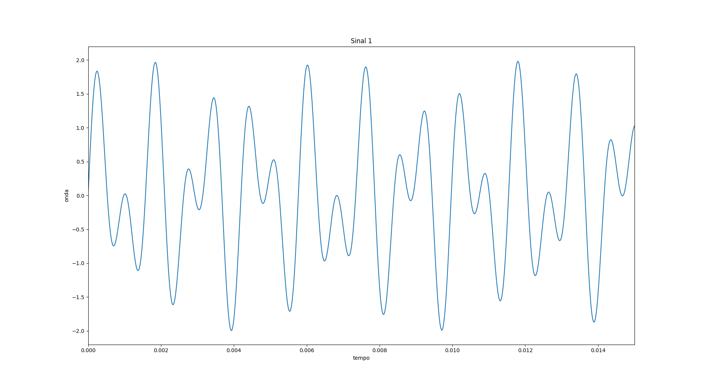
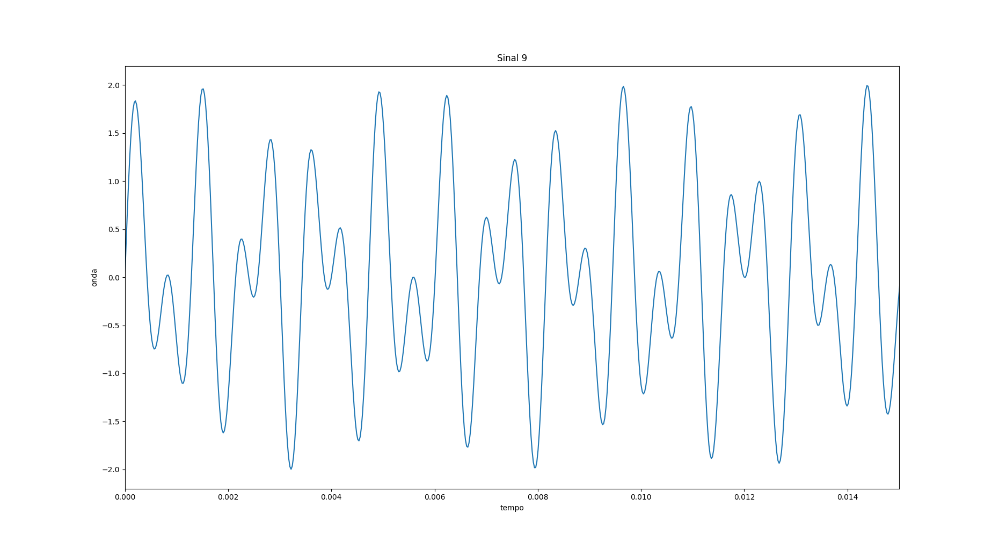
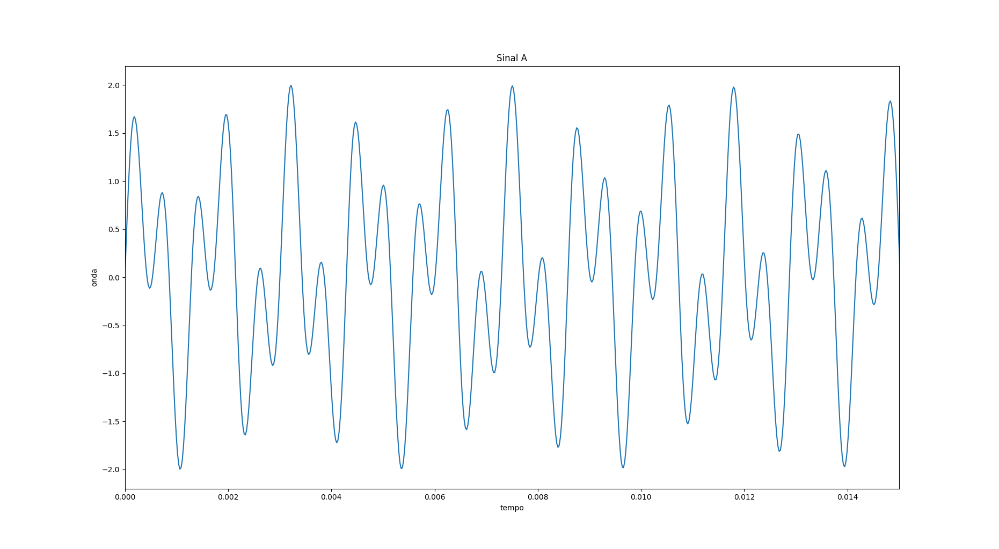
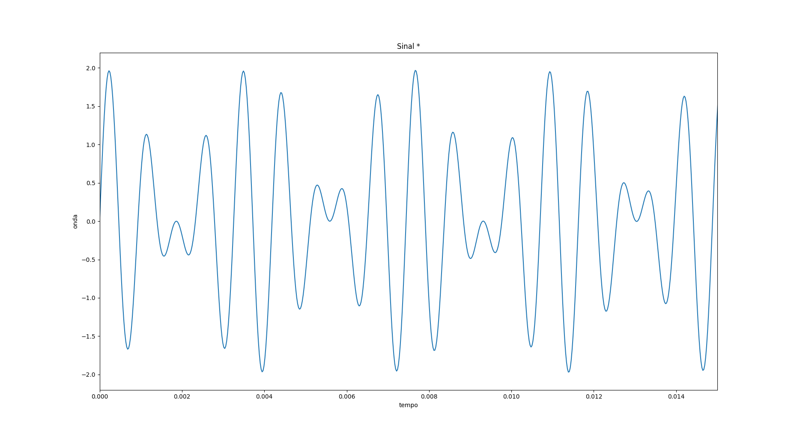

# Proj-2-DTMF
Projeto 2 Camada Física - 2017.2

## Geração dos tons

Cada tom foi gerado a partir da soma de duas ondas com frequências diferentes.

## Frequências que compõem cada tom
|             |1209 Hz  |1336 Hz  |1477 Hz  |1633 Hz  |
|:-----------:|:-------:|:-------:|:-------:|:-------:|
|**697 Hz**   |1        |2        |3        |A        |
|**770 Hz**   |4        |5        |6        |B        |
|**852 Hz**   |7        |8        |9        |C        |
|**941 Hz**   |*        |0        |#        |D        |

## Tons Gerados e Captados
| Tecla | Gerado                  |Captado               |
|:-----:|-------------------------|----------------------|
|1      |         |       |
|2      |         |       |
|3      |         |       |
|4      |         |       |
|5      |         |       |
|6      |         |       |
|7      |         |       |
|8      |         |       |
|9      |         |       | 
|0      |         |       |
|A      |         |       |
|B      |         |       |
|C      |         |       |
|D      |         |      |
|*      |   |    |
|#      |      | |

