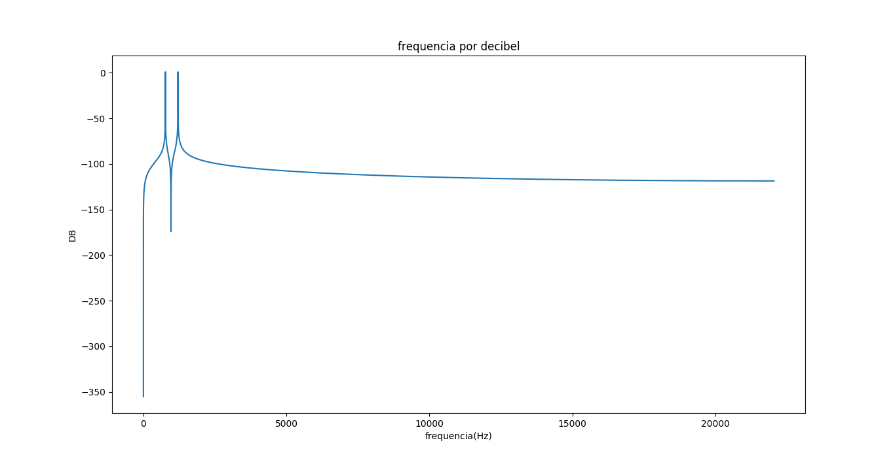
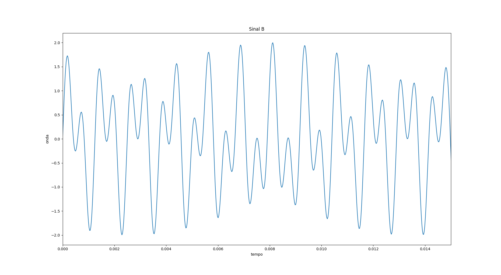
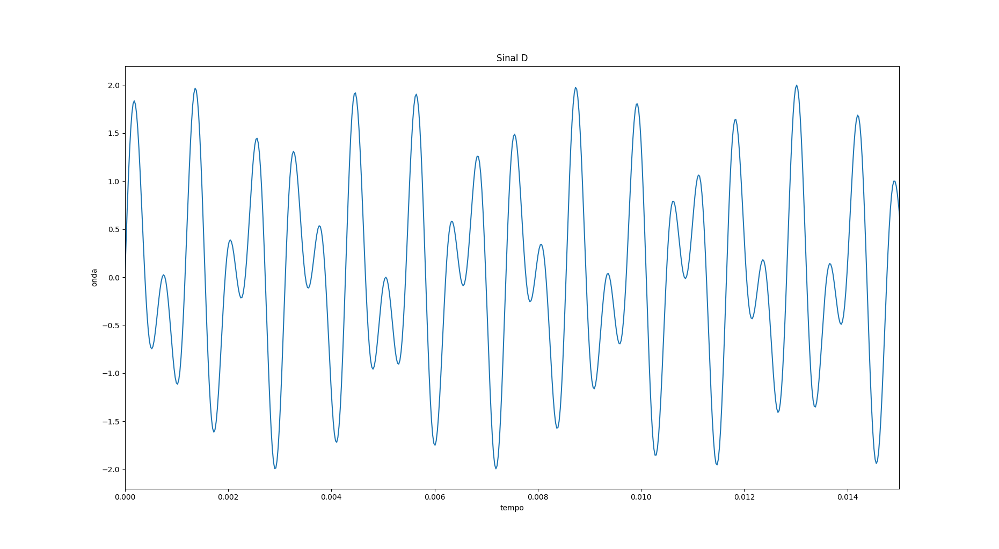
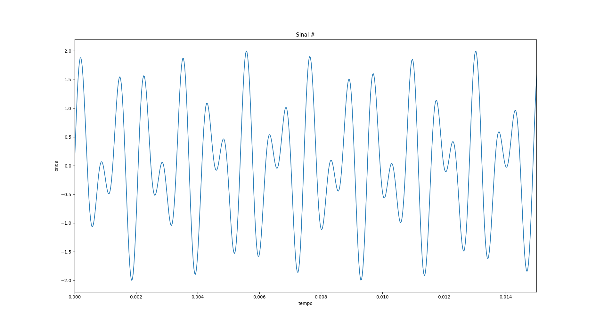

# Proj-2-DTMF
Projeto 2 Camada Física - 2017.2
# Parte 2 - Decoder

| Tom   | Sinal Transmitido       |Sinal Captado         |
|:-----:|-------------------------|----------------------|
|1      |         |      |
|2      |         |      |
|3      |         |      |
|4      |         |      |
|5      |         |      |
|6      |         |      |
|7      |         |      |
|8      |         |      |
|9      |         |      | 
|0      |         |      |
|A      |        |      |
|B      |         |      |
|C      |         |      |
|D      |         |      |
|*      |   |   |
|#      |      ||

## Frequências enviadas e recebidas
| Tom   | Frequência Enviada (Hz) |Frequência Recebida (Hz)|
|:-----:|:-----------------------:|:----------------------:|
|1      |697, 1209                |697, 1209               |
|2      |697, 1336                |697, 1336               |
|3      |697, 1477                |697, 1477               |
|4      |770, 1209                |770, 1209               |
|5      |770, 1336                |770, 1336               |
|6      |770, 1477                |770, 1477               |
|7      |852, 1209                |852, 1209               |
|8      |852, 1336                |852, 1336               |
|9      |852, 1477                |852, 1477               | 
|0      |941, 1336                |941, 1336               |
|A      |697, 1633                |697, 1633               |
|B      |770, 1633                |770, 1633               |
|C      |852, 1633                |852, 1633               |
|D      |941, 1633                |941, 1633               |
|*      |941, 1209                |941, 1209               |
|#      |941, 1477                |941, 1477               |

## Justificativa dos tempos utilizados
A cada 1 segundo atualizamos gráfico e informações na interface (tom e frequências recebidos) conforme aúdio recebido, já para o sinal gerado são 2 segundos, assim o [decoderDTMF.py](https://github.com/elisamalzoni/Proj-2-DTMF/blob/master/decoderDTMF.py) conseguirá identificar. 

# Parte 1 - Encoder
## Geração dos tons

Cada tom foi gerado a partir da soma de duas ondas com frequências diferentes. Para tanto, usamos a fórmula *sen(wt)* para gerar a onda, sendo *w = 2πf* (f é uma das frequncias que compõe cada tom) e com o seno variando em função do tempo. A geração deste sinal está no arquivo [encoderDTMF.py](https://github.com/elisamalzoni/Proj-2-DTMF/blob/master/encoderDTMF.py) e o som tem um segundo de duração. A chamda da função de gerar os tons estão no arquivo [keypad.py](https://github.com/elisamalzoni/Proj-2-DTMF/blob/master/keypad.py), que é a interface do projeto.

## Frequências que compõem cada tom
|             |1209 Hz  |1336 Hz  |1477 Hz  |1633 Hz  |
|:-----------:|:-------:|:-------:|:-------:|:-------:|
|**697 Hz**   |1        |2        |3        |A        |
|**770 Hz**   |4        |5        |6        |B        |
|**852 Hz**   |7        |8        |9        |C        |
|**941 Hz**   |*        |0        |#        |D        |

## Tons Gerados e Captados

Os gráficos abaixo corresponde o sinal de cada um dos tons em função do tempo. A coluna da esquerda representa a soma dos senos das duas frequências utilizadas. Já nos gráficos da direita, primeiramente, ouviu-se o som de outro computador, e a partir disso, foi gerado o gráfico correspondente. Como é possível notar, apesar de semelhantes, ainda é possível ver várias interferências (ruídos) que modificam a onda gerada. A captação de som e a geração deste gráfico está no arquivo [decoderDTMF.py](https://github.com/elisamalzoni/Proj-2-DTMF/blob/master/decoderDTMF.py)

| Tecla | Gerado                  |Captado               |
|:-----:|-------------------------|----------------------|
|1      |         |       |
|2      |         |       |
|3      |         |       |
|4      |         |       |
|5      |         |       |
|6      |         |       |
|7      |         |       |
|8      |         |       |
|9      |         |       | 
|0      |         |       |
|A      |         |       |
|B      |         |       |
|C      |         |       |
|D      |         |       |
|*      |   |    |
|#      |      | |
